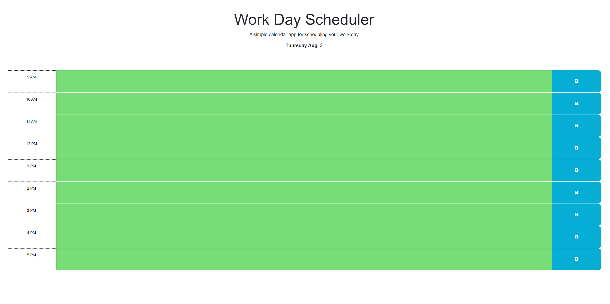
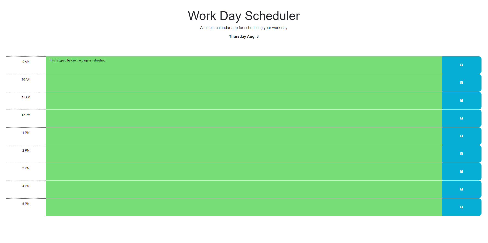

# Task Scheduler by Sam Ebadi Sobi

## here is the live URL: https://captaineb.github.io/Task-Scheduler/

This app helps orgonize the daily tasks. you can type the task in the appropriate row and hit the save button, this will save the task to the local storage and will show the task in the right row even on a page refresh.

## Here are some screenshots of the app (the app depends on the currect time of day to work properly and these screenshots were taken before 9 am):

All of the code except for the starter code was written by Sam Ebadi Sobi.
